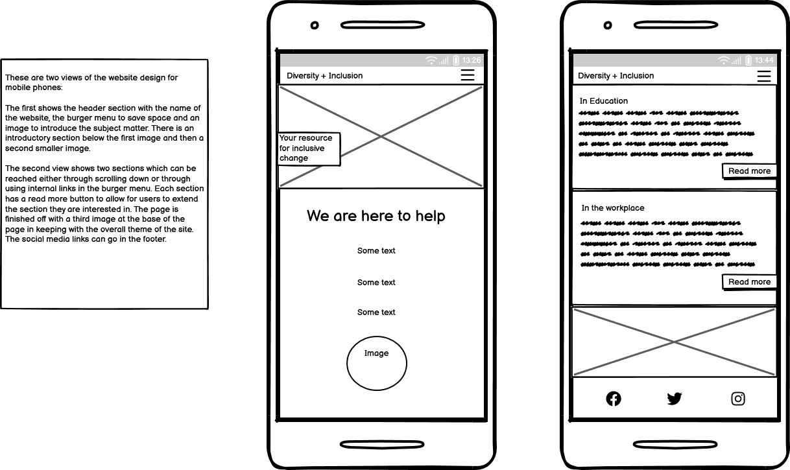
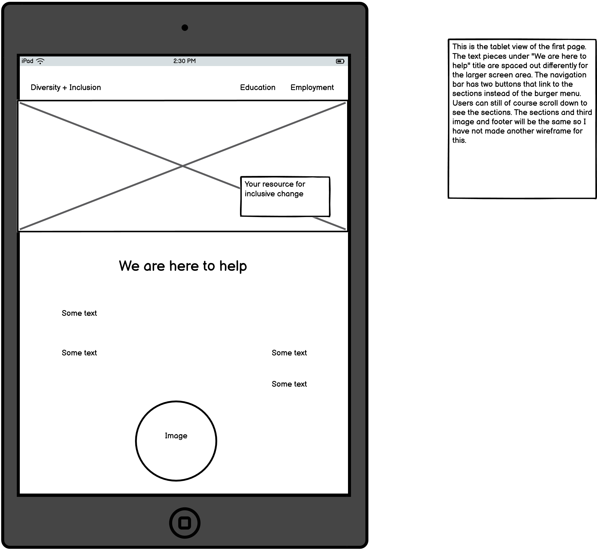
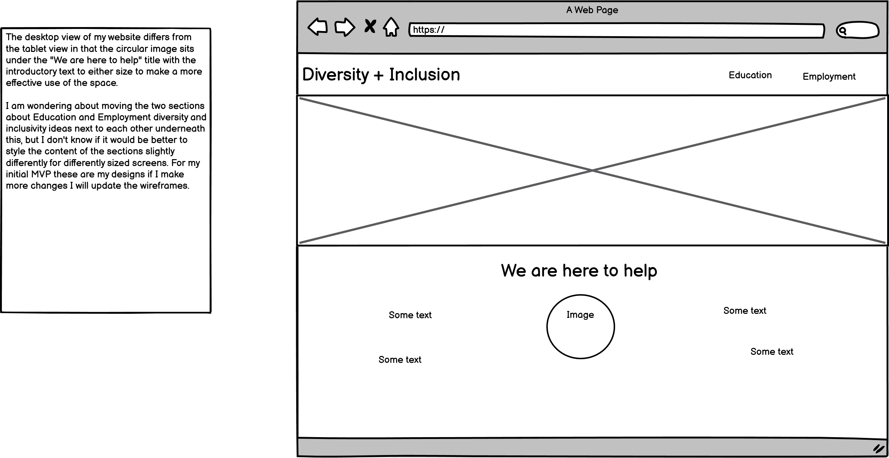

# Diversity + Inclusion

## Overview

### Purpose
This website's purpose is to introduce concepts around diversity and inclusion for the workplace or in an educational environment. The aim is to offer straightforward information and tips on how to implement practices which support a diverse community of people and help them feel included and valued. The idea is to present this information in a clear, organized format, creating a visually appealing, easy-to-navigate website. This should help the target audience quickly access the information or links that they need.  

### Target Audience
The target audience for this project are people working in the education sector or employers and workplace managers. At first I was thinking about including other user groups in my planning such as people in education, parents and carers of people in education, people seeking employment and people in employment. However the original brief seemed to suggest a narrower focus of presenting basic guidance and information specific to helping to outline what is best practice within educational or workplace environments. 

I have tried to think about what various different users working within either different educational age-groups or various workplaces would want information about. This is reflected in the user stories below. Some of the things that came up when I was working on the user stories are the number of specific things people could be looking for and the need to balance general advice with more focussed help. I have decided to set up a More Information area with links in both the Education and Employment sections whilst maintaining providing a general overview of diversity and inclusion practices in the main body of each section.

## User Stories

Education Section:
- **User Story 1:** As an early years teacher I want to help provide an inclusive environment and find out about play-based learning within this field. 

  **Acceptance Criteria:** Have appropriate age-range guidance and specific link(s) to lesson plans and/or resources for play-based learning to help with diversity and inclusion.

- **User Story 2:** As a primary school teacher I would like to find out about teaching practices that cater to diverse cultural,social and learning needs and that recognize different learning styles and foster respect.

  **Acceptance Criteria:** Age-appropriate advice, general tips for catering to diverse needs, specific links for different learning styles information.

- **User Story 3:** As a secondary school teacher I would like to address any bullying as a result of perceived difference. I'm looking for advice about promoting a safe environment for all the students.

  **Acceptance Criteria:** Guidance on trying to avoid bullying through fostering an inclusive environment, links for more specific advice for dealing with existing bullying and ways to create a welcoming, safe space for all students.

 - **User Story 4:** As a tutor in further education I am looking to create an initiative to increase participation from underrepresented groups.

    **Acceptance Criteria:** General diversity and inclusion guidelines for welcoming a more diverse cohort, specific links for setting up an initiative like this. 

Employment Section:
  - **User Story 5:** As a manager in the corporate sector I am looking for a framework for implementing a diversity training programme.

    **Acceptance Criteria:** General diversity and inclusion guidelines for welcoming a more diverse cohort, specific links for setting up an initiative like this.

  - **User Story 6:** As a worker in the public sector I would like to know where to access goverment equality policies.

    **Acceptance Criteria:** Include a specific link to goverment equality and diversity guidelines, would be good for all users to have a link to laws around the topics.    

 - **User Story 7:** As a healthcare worker in the NHS I would like to find out about ways to address health disparities in order to improve patient outcomes.

    **Acceptance Criteria:** Include specific link for websites/ resources that provide information about this.

  - **User Story 8:** As a worker in a non-profit organization I would like to find ways to increase stakeholder involvement.

    **Acceptance Criteria:** Include specific link for websites/ resources that provide information about this.

  - **User Story 9:** As a worker in hospitality I would like to set up training for cultural sensitivity and anti-discrimination practices to create a more welcoming environment for diverse clientele.

    **Acceptance Criteria:** General core principles advice for an overall view and then include specific links in the more infomation section.

## Design Decisions

### Wireframes

  
Briefly describe the design choices, including layout, colour schemes, and fonts. 

This is going to be a responsive, mobile first development, as the majority of internet traffic comes from mobile phones but the site will also make the most of larger screen sizes. This is a one page layout with a main navigation menu and structured content. I am using colour contrast and alt-text for non-text elements to make the site more accessible. I am introducing the topic of diversity and inclusivity with an image at the top and a message about what the content can provide. The content is organized into clear sections with headings and paragraphs that outline the key priciples of diversity and inclusion. I am providing a simple list of tips and best practices to help users understand how to promote diversity. I am using button styling for links to external resources making them easy to identify and click. I have used the Roboto font from Google Fonts as a base font and the Lato font as a title font. The colours I am using are: #3a3a3a for the text and styling the icons in the footer and also for my box shadow. The background is white (#ffffff#). (Should some of this be in features section?)

**Guidance:** Start this section during Phase 1: Ideation & Initial Setup and update it throughout Phase 2 and Phase 3. Include digital wireframes created in Phase 1. Document the reasoning behind your layout choices, colour schemes, and font selections.

### Accessibility Considerations
colour contrast and alt text for images.  
**Guidance:** Outline how you've incorporated accessibility into your design, ensuring that your project adheres to guidelines such as WCAG.

## Features Implementation

### Features 
- **Feature 1:** Description of the implemented feature.
- **Feature 2:** Description of the implemented feature.

   (features earmarked for future project iterations?)

## Testing and Validation

### Testing Results
Summarize the results of testing across different devices and screen sizes.  
Mention any issues found and how they were resolved.  
**Guidance:** Summarize the results of your testing across various devices using tools like Chrome DevTools, as outlined in Phase 2. Mention any issues found and how they were resolved.

### Validation
Discuss the validation process for HTML and CSS using W3C and Jigsaw validators.  
Include the results of the validation process.  
**Guidance:** Document your use of W3C and Jigsaw validators to ensure your HTML and CSS meet web standards. Include any errors or warnings encountered and how they were resolved.

## Deployment

### Deployment Process
Briefly describe the deployment process to GitHub Pages or another cloud platform.  
Mention any specific challenges encountered during deployment.  
**Guidance:** Describe the steps you took to deploy your website during Phase 4: Final Testing, Debugging & Deployment, including any challenges encountered.

## Reflection on Development Process

### Successes

### Challenges
Describe any challenges faced 

### Final Thoughts
Provide any additional insights gained during the project and thoughts on the overall process.  
**Guidance:** Begin drafting reflections during Phase 1 and update throughout the project. Finalize this section after Phase 4. Highlight successes and challenges, regarding, and provide overall insights into the project.

## Code Attribution and other credits
Properly attribute any external code sources used in the project (excluding GitHub Copilot-generated code).  
**Guidance:** Document any external code sources used throughout the entire project, especially during Phase 2 and Phase 3. Exclude GitHub Copilot-generated code from attribution.

Need to reference images, code that inspired you, text/copy not written by you, resources that assisted your project.

Scope for business, colour contrast accessibility: https://business.scope.org.uk/colour-contrast-and-accessibility/

Design your way, accessible typography: https://www.designyourway.net/blog/best-fonts-for-accessibility/

WCAG information

Pexels website (put specific image references in)

Accessible colour palette builder: https://toolness.github.io/accessible-color-matrix/ 

Google Fonts (For Roboto and Lato fonts): https://fonts.google.com/ 

Cloudconvert.com used to convert image files from pexels to webp format for quicker load times to improve user experience.

## Future Improvements
Briefly discuss potential future improvements or features that could be added to the project.  
**Guidance:** Reflect on potential enhancements that could be made to the project after Phase 4: Final Testing, Debugging & Deployment. These could be Could user story features you didn’t have time to implement or improvements based on testing feedback.

