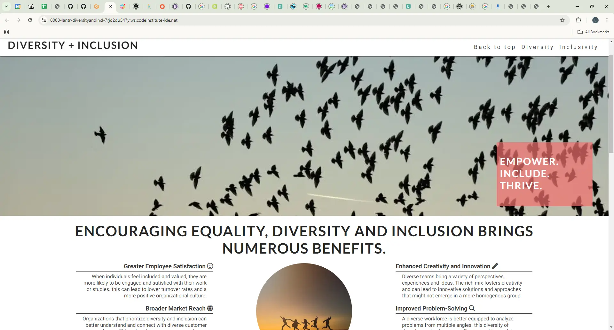
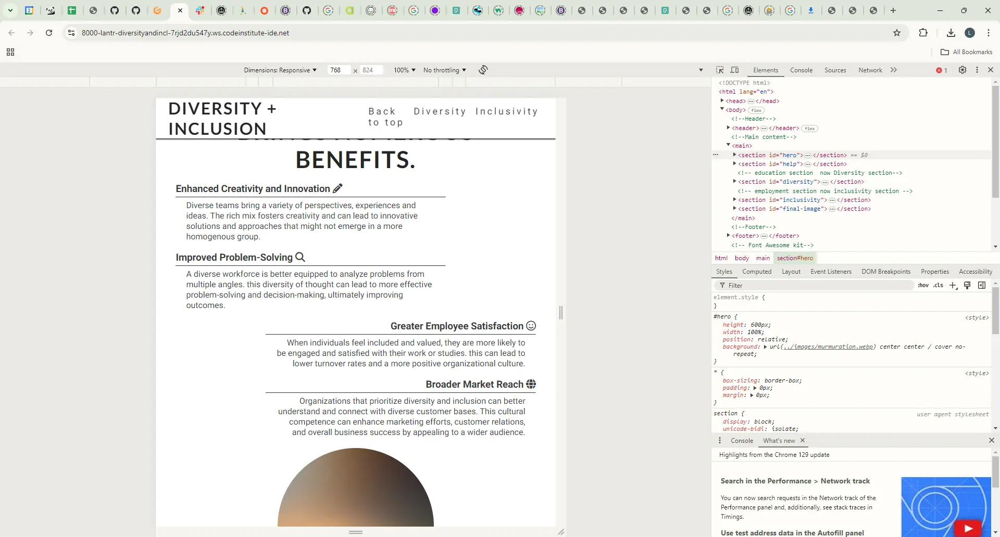
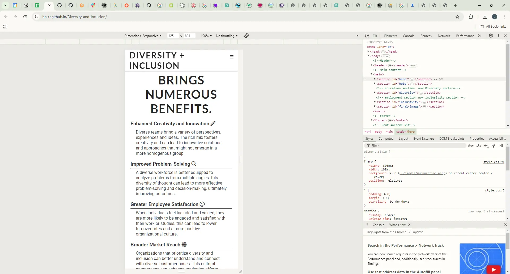

# Diversity + Inclusion

## Overview

### Purpose
This website's purpose is to introduce concepts around diversity and inclusion for the workplace or in an educational environment. The aim is to offer straightforward information and tips on how to implement practices which support a diverse community of people and help them feel included and valued. The idea is to present this information in a clear, organized format, creating a visually appealing, easy-to-navigate website. This should help the target audience quickly access the information that they need.  

### Target Audience
The target audience for this project are people working in the education sector or employers and workplace managers. At first I was thinking about including other user groups in my planning such as people in education, parents and carers of people in education, people seeking employment and people in employment. However the original brief seemed to suggest a narrower focus of presenting basic guidance and information specific to helping to outline what is best practice within educational or workplace environments. 

I have tried to think about what various different users working within either different educational age-groups or various workplaces would want information about. This is reflected in the user stories below. Some of the things that came up when I was working on the user stories are the number of specific things people could be looking for and the need to balance general advice with more focussed help. I have decided to set up a More Information area with links in both the Education and Employment sections whilst maintaining providing a general overview of diversity and inclusion practices in the main body of each section.

### Update

I didn't set up the More Information sections and I pared back the content I was going to include quite considerably. It was just too much text and trying to be too many things at once. I focussed instead on the original brief to provide a basic understanding of diversity and inclusion. I will comment more about changing the content once I had started building the site in the Challenges and Final Thoughts section. Obviously it is not the best approach.

## User Stories

Education Section:
- **User Story 1:** As an early years teacher I want to help provide an inclusive environment and find out about play-based learning within this field. 

  **Acceptance Criteria:** Have appropriate age-range guidance and specific link(s) to lesson plans and/or resources for play-based learning to help with diversity and inclusion.

- **User Story 2:** As a primary school teacher I would like to find out about teaching practices that cater to diverse cultural,social and learning needs and that recognize different learning styles and foster respect.

  **Acceptance Criteria:** Age-appropriate advice, general tips for catering to diverse needs, specific links for different learning styles information.

- **User Story 3:** As a secondary school teacher I would like to address any bullying as a result of perceived difference. I'm looking for advice about promoting a safe environment for all the students.

  **Acceptance Criteria:** Guidance on trying to avoid bullying through fostering an inclusive environment, links for more specific advice for dealing with existing bullying and ways to create a welcoming, safe space for all students.

 - **User Story 4:** As a tutor in further education I am looking to create an initiative to increase participation from underrepresented groups.

    **Acceptance Criteria:** General diversity and inclusion guidelines for welcoming a more diverse cohort, specific links for setting up an initiative like this. 

Employment Section:
  - **User Story 5:** As a manager in the corporate sector I am looking for a framework for implementing a diversity training programme.

    **Acceptance Criteria:** General diversity and inclusion guidelines for welcoming a more diverse cohort, specific links for setting up an initiative like this.

  - **User Story 6:** As a worker in the public sector I would like to know where to access goverment equality policies.

    **Acceptance Criteria:** Include a specific link to goverment equality and diversity guidelines, would be good for all users to have a link to laws around the topics.    

 - **User Story 7:** As a healthcare worker in the NHS I would like to find out about ways to address health disparities in order to improve patient outcomes.

    **Acceptance Criteria:** Include specific link for websites/ resources that provide information about this.

  - **User Story 8:** As a worker in a non-profit organization I would like to find ways to increase stakeholder involvement.

    **Acceptance Criteria:** Include specific link for websites/ resources that provide information about this.

  - **User Story 9:** As a worker in hospitality I would like to set up training for cultural sensitivity and anti-discrimination practices to create a more welcoming environment for diverse clientele.

    **Acceptance Criteria:** General core principles advice for an overall view and then include specific links in the more infomation section.

## Update

I think the above user stories were too specific for the brief, I initially tried putting in two sections one for advice for educators and one advice for employers, and then trying to cover different age groups and different workplaces in those respective sections but it both seemed to provide too much information and not enough and fall between two stools really. I went back to the brief and simplified my content and the two sections became one titled Diversity and one titled Inclusivity. I think this reflects my lack of familiarity with the user stories approach and I should have pared this all back at the design stage.

The goals we were given for the assignment were:

External User’s Goal:
The user wants to gain a basic understanding of diversity and inclusion in the workplace or educational environment. They seek straightforward information and tips presented in a clear, organised format.

Site Owner’s Goal:
The site owner aims to create a visually appealing, easy-to-navigate webpage that introduces diversity and inclusion concepts and offers basic guidance on how to implement these practices. The focus is on clear communication through effective use of HTML and CSS.

These were the two sets of needs I focussed on in the end.

## Design Decisions

### Wireframes

  
This is going to be a responsive, mobile first development, as the majority of internet traffic comes from mobile phones but the site will also make the most of larger screen sizes. This is a one page layout with a main navigation menu and structured content. I am using colour contrast and alt-text for non-text elements to make the site more accessible. I am introducing the topic of diversity and inclusivity with an image at the top and a message about what the content can provide. The content is organized into clear sections with headings and paragraphs that outline the key priciples of diversity and inclusion. I am providing a simple list of tips and best practices to help users understand how to promote diversity. 

I have used the Roboto font from Google Fonts as a base font and the Lato font as a title font. The colours I am using are: #3a3a3a for the text and styling the icons in the footer and also for my box shadow. The background is white (#ffffff#) and the h1 text is #252525. The cover text box is rgba (241, 109, 107, .7) the .7 makes it slightly transparent, the colour complements the sky image and adds a splash of colour to the hero image.

**Update** 

The design changed from my wireframes as I decided to change the content, cover text, and section headings. The cover text changed from 'Your resource for inclusive change' to 'Impower. Include. Thrive.' The 'We are here to help' section became 'Encouraging Equality, Diversity And Inclusion Brings Numerous Benefits'. The two sections accessible through internal links became 'Diversity' and 'Inclusion'.

### Screenshots of deployed site

Screenshot of monitor with fullscreen view of deployed site:

Screenshot of tablet sized view of benefits section:

Screenshot of mobile sized view of benefits section:

### Accessibility Considerations
 
I used colour contrasting text and backgrounds and I added alt text for my font awesome icons. I followed guidance about the background images and decorative images that I shouldn't add alt text for these as if they were pure decoration the alt text could confuse or clutter the screen reader experience. I added hidden headings though to any sections that didn't have them, this was picked up by the validator. 

## Features 
 
- **Feature 1:** Hero section: Header section to introduce the topic with image and cover text.

- **Feature 2:** Navigation: burger menu for mobile view, separate headings for larger views, internal links.

- **Feature 3:** Images: Responsive at different sizes, particularly circular image.

- **Feature 4:** Layout: responsive at different screen sizes use media queries to maintain integrity across different sizes: mobile phones, tablets 768px or larger, laptops/ desktops 992px or larger and bigger screens at 1200px or larger.

- **Feature 5:** Information sections: Content organized into clear sections with headings and paragraphs that outline key principles of diversity and inclusion.

- **Feature 6:** Links to social media in footer: hand appears when hover over.

## Testing and Validation

### Testing Results

Tested across various browsers on my computer: Google Chrome, Firefox and Microsoft Edge and the site was working on all of them.

Tested the site on my iphone on the duck duck go browser and the site worked as expected. The drop down from the burger menu obscures the title when using the internal links, I would have liked to make the menu close on the click action but I couldn't get this to work.

### Validation

I ran my html code through the W3C Markup Validation Service available here: https://validator.w3.org/

I was using the html command br in my list to separate out the list items on the page but I changed this to adding in a margin-bottom: 15px in my CSS file. I also didn't have headings for my 'characteristics' and 'final image' sections so I added in headings and gave them a class of "hidden" and targeted this in the CSS with display: none. I then ran the code through again and everything was fine and there were "no errors".

I ran my CSS code through the W3C  CSS Validation Service available here: https://jigsaw.w3.org/css-validator/

There were no errors in my CSS code acording to the validator so I didn't make any changes.

## Deployment

### Deployment Process

I used the deployment advice from code Institute's Lets Deploy! section on the LMS:

Go to the Settings tab of your GitHub repo.

On the left-hand sidebar, in the Code and automation section, select Pages.

Make sure:

Source is set to 'Deploy from Branch'.

Main branch is selected.

Folder is set to / (root).

Under Branch, click Save.

Go back to the Code tab. Wait a few minutes for the build to finish and refresh your repo.

Click View deployment to see the live site. The URL will look similar to YOUR-USERNAME.github.io/Your-Project-Title.

Once deployed I tested the site on different browsers and my phone as outlined above in the Testing Results section and it worked the same as in the browser window from my gitpod.

## Reflection on Development Process

### Successes

I made a webpage and can click on the repository link and see something I made in a web browser or on my phone. This is my first proper webpage and I liked this aspect of the project, though I know there are things to improve.

### Challenges and Final Thoughts

At the end of this process I feel I better understand what I should have done in the planning stage to make the website building phase more straight forward. I should have whittled down the user stories and prioritzed what content I needed. I should have planned the features more especially the sections containing the information. I should have planned out the whole layout at the beginning instead of trying to add things in as I went as when I came to the Diversity and Inclusion sections I didn't have the layout in place to make them as responsive as I would have liked.

## Code Attribution and other credits
 
### Some resources that I used:

Scope for business, colour contrast accessibility: https://business.scope.org.uk/colour-contrast-and-accessibility/

Design your way, accessible typography: https://www.designyourway.net/blog/best-fonts-for-accessibility/

WCAG information

Pexels website: https://www.pexels.com/

Accessible colour palette builder: https://toolness.github.io/accessible-color-matrix/ 

Google Fonts (For Roboto and Lato fonts): https://fonts.google.com/ 

Cloudconvert.com used to convert image files from pexels to webp format for quicker load times to improve user experience.

icons from font awesome: https://fontawesome.com/

I adapted some code from Code Institute projects and LMS resources that I have worked through previously: I looked at the internal links section again, Love Running, the Whiskey Drop things, the Individual Formative Assignment information and included the Goals for the project. I also used the Miro board information from a guided session to find where to convert my images to webp files. I looked up how to do some other things that ultimately didn't work/get included such as making and adding javicons and creating a dropdown accordian for my Diversity and Inclusion sections. I looked up some things on shecodes, w3schools and googled some other things to check things as I went along, or that I suddenly thought about before I went to sleep.

I took my text content partly adapted from things generated by ChatGPT and from Acas, the Advisory, Conciliation and Arbitration Service website: https://www.acas.org.uk/improving-equality-diversity-and-inclusion

The specific photo credits for the images I used from the pexel site are:

Hero image: papatya films - photo of birds flying together

Benefits image: Maksim Ramashkin - Unrecognizable happy people jumping in sunset

Final image: Oleksandr P - Color Pencil Lot

## Future Improvements

For this specific site I would like to make it so that when you click on the burger icon drop down menu the menu closes on the click action so it stops obscuring the titles of the sections it is linking to.

For myself making other sites I would change my planning process, I think by doing this project I have a better idea of how to approach something else in the future and would plan my layout all at the beginning and be more definite about the content and how I wanted everything to look and where I was going to find out any information instead of adding things in as I went along.

