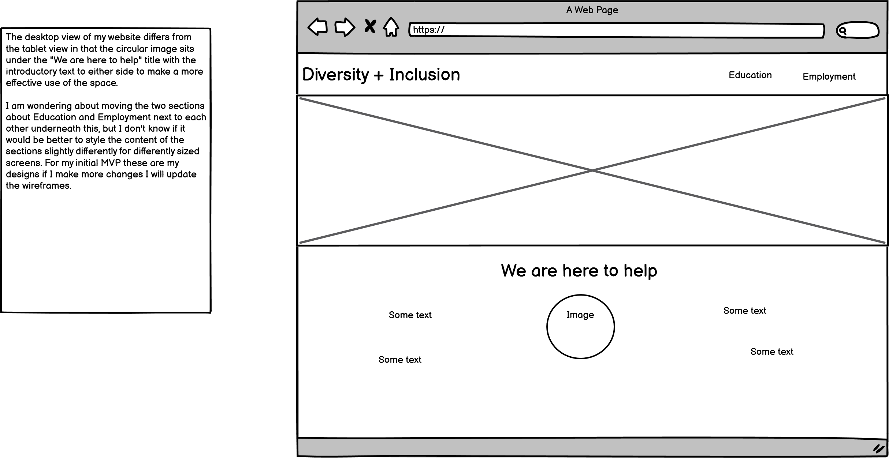

# Diversity + Inclusion

## Overview

### Purpose
This website's purpose is to introduce concepts around diversity and inclusion for the workplace or in an educational environment. The aim is to offer straightforward information and tips on how to implement practices which support a diverse community of people and help them feel included and valued. The idea is to present this information in a clear, organized format, creating a visually appealing, easy-to-navigate website. This should help the target audience quickly access the information or links that they need.  

### Target Audience
The target audience for this project are people working in the education sector or employers and workplace managers. At first I was thinking about including other user groups in my planning such as people in education, parents and carers of people in education, people seeking employment and people in employment. However the original brief seemed to suggest a narrower focus of presenting basic guidance and information specific to helping to outline what is best practice within educational or workplace environments. 

I have tried to think about what various different users working within either different educational age-groups or various workplaces would want information about. This is reflected in the user stories below. Some of the things that came up when I was working on the user stories are the number of specific things people could be looking for and the need to balance general advice with more focussed help. I have decided to set up a More Information area with links in both the Education and Employment sections whilst maintaining providing a general overview of diversity and inclusion practices in the main body of each section.

## User Stories

Education Section:
- **User Story 1:** As an early years teacher I want to help provide an inclusive environment and find out about play-based learning within this field. 

  **Acceptance Criteria:** Have appropriate age-range guidance and specific link(s) to lesson plans and/or resources for play-based learning to help with diversity and inclusion.

- **User Story 2:** As a primary school teacher I would like to find out about teaching practices that cater to diverse cultural,social and learning needs and that recognize different learning styles and foster respect.

  **Acceptance Criteria:** Age-appropriate advice, general tips for catering to diverse needs, specific links for different learning styles information.

- **User Story 3:** As a secondary school teacher I would like to address any bullying as a result of perceived difference. I'm looking for advice about promoting a safe environment for all the students.

  **Acceptance Criteria:** Guidance on trying to avoid bullying through fostering an inclusive environment, links for more specific advice for dealing with existing bullying and ways to create a welcoming, safe space for all students.

 - **User Story 4:** As a tutor in further education I am looking to create an initiative to increase participation from underrepresented groups.

    **Acceptance Criteria:** General diversity and inclusion guidelines for welcoming a more diverse cohort, specific links for setting up an initiative like this. 

Employment Section:
  - **User Story 5:** As a manager in the corporate sector I am looking for a framework for implementing a diversity training programme.

    **Acceptance Criteria:** General diversity and inclusion guidelines for welcoming a more diverse cohort, specific links for setting up an initiative like this.

  - **User Story 6:** As a worker in the public sector I would like to know where to access goverment equality policies.

    **Acceptance Criteria:** Include a specific link to goverment equality and diversity guidelines, would be good for all users to have a link to laws around the topics.    

 - **User Story 7:** As a healthcare worker in the NHS I would like to find out about ways to address health disparities in order to improve patient outcomes.

    **Acceptance Criteria:** Include specific link for websites/ resources that provide information about this.

  - **User Story 8:** As a worker in a non-profit organization I would like to find ways to increase stakeholder involvement.

    **Acceptance Criteria:** Include specific link for websites/ resources that provide information about this.

  - **User Story 9:** As a worker in hospitality I would like to set up training for cultural sensitivity and anti-discrimination practices to create a more welcoming environment for diverse clientele.

    **Acceptance Criteria:** General core principles advice for an overall view and then include specific links in the more infomation section.

## Design Decisions

### Wireframes

  
Briefly describe the design choices, including layout, colour schemes, and fonts.  
**Guidance:** Start this section during Phase 1: Ideation & Initial Setup and update it throughout Phase 2 and Phase 3. Include digital wireframes created in Phase 1. Document the reasoning behind your layout choices, colour schemes, and font selections.

### Accessibility Considerations
colour contrast and alt text for images.  
**Guidance:** Outline how you've incorporated accessibility into your design, ensuring that your project adheres to guidelines such as WCAG.

## AI Tools Usage

### DALL-E
Describe how DALL-E was used for image generation, including examples of successes and challenges.  
**Guidance:** Specifically mention how you used DALL-E for image generation and the impact this had on your design process.

## Features Implementation

### Core Features (Must-Haves)
- **Feature 1:** Description of the implemented feature.
- **Feature 2:** Description of the implemented feature.

(Include all must-have features)  
**Guidance:** Use this section as you complete Phase 2: Must User Stories Implementation & Testing. Document all the must-have features you implemented, explaining how they align with the user stories and acceptance criteria.

### Advanced Features (Should-Haves)
- **Feature 1:** Description of the implemented feature.
- **Feature 2:** Description of the implemented feature.

(Include all should-have features)  
**Guidance:** Include any advanced features you implemented during Phase 3: Should User Stories Implementation & Any Advanced Features. Explain how these features enhance user experience and their alignment with the acceptance criteria.

### Optional Features (Could-Haves)
- **Feature 1:** Description of the implemented feature (if any).
- **Feature 2:** Description of the implemented feature (if any).

(Include any could-have features that were implemented or considered)  
**Guidance:** If any could-have features were implemented, describe them here. This is an opportunity to showcase extra work done beyond the initial scope. But remember - keep it simple! Focus on the Must stories first. Could user story features are commonly earmarked for future project iterations.

## AI Tools Usage

### GitHub Copilot
Describe how GitHub Copilot assisted in coding, including any challenges or adjustments needed.  
**Guidance:** Reflect on how GitHub Copilot assisted in coding, particularly any challenges or adjustments that were needed to align with project goals.

## Testing and Validation

### Testing Results
Summarize the results of testing across different devices and screen sizes.  
Mention any issues found and how they were resolved.  
**Guidance:** Summarize the results of your testing across various devices using tools like Chrome DevTools, as outlined in Phase 2. Mention any issues found and how they were resolved.

### Validation
Discuss the validation process for HTML and CSS using W3C and Jigsaw validators.  
Include the results of the validation process.  
**Guidance:** Document your use of W3C and Jigsaw validators to ensure your HTML and CSS meet web standards. Include any errors or warnings encountered and how they were resolved.

## AI Tools Usage

### GitHub Copilot
Brief reflection on the effectiveness of using AI tools for debugging and validation.  
**Guidance:** Reflect on how GitHub Copilot assisted with debugging and validation, particularly any issues it helped resolve.

## Deployment

### Deployment Process
Briefly describe the deployment process to GitHub Pages or another cloud platform.  
Mention any specific challenges encountered during deployment.  
**Guidance:** Describe the steps you took to deploy your website during Phase 4: Final Testing, Debugging & Deployment, including any challenges encountered.

## AI Tools Usage

### Reflection
Describe the role AI tools played in the deployment process, including any benefits or challenges.  
**Guidance:** Reflect on how AI tools assisted with the deployment process, particularly how they streamlined any tasks or presented challenges.

## Reflection on Development Process

### Successes
Effective use of AI tools, including GitHub Copilot and DALL-E, and how they contributed to the development process.

### Challenges
Describe any challenges faced when integrating AI-generated content and how they were addressed.

### Final Thoughts
Provide any additional insights gained during the project and thoughts on the overall process.  
**Guidance:** Begin drafting reflections during Phase 1 and update throughout the project. Finalize this section after Phase 4. Highlight successes and challenges, particularly regarding the use of AI tools, and provide overall insights into the project.

## Code Attribution
Properly attribute any external code sources used in the project (excluding GitHub Copilot-generated code).  
**Guidance:** Document any external code sources used throughout the entire project, especially during Phase 2 and Phase 3. Exclude GitHub Copilot-generated code from attribution.

## Future Improvements
Briefly discuss potential future improvements or features that could be added to the project.  
**Guidance:** Reflect on potential enhancements that could be made to the project after Phase 4: Final Testing, Debugging & Deployment. These could be Could user story features you didn’t have time to implement or improvements based on testing feedback.

